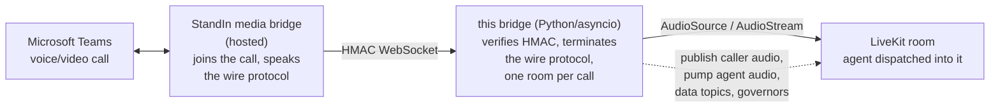
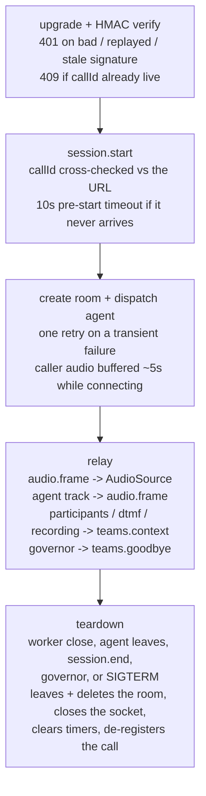

The bridge is a small, stateless-per-call relay. Per call it holds one WebSocket (the StandIn media bridge) and one LiveKit room membership, and mostly copies audio between them.

## System overview

The StandIn media bridge handles everything about Teams itself and exposes each call as a single WebSocket carrying `audio.frame` (PCM 16 kHz), `video.frame` (JPEG) and control messages. This bridge has no idea what is on the other end of the Teams call - it only speaks the wire protocol.

## The audio path

The worker speaks base64 **PCM 16 kHz, 16-bit, mono** natively. On the room side the bridge publishes caller audio through an `AudioSource` and reads the agent's track through an `AudioStream` opened at 16 kHz mono - the LiveKit SDK does any resampling, so **the bridge itself never transcodes**. Malformed PCM (odd byte counts) is rejected loudly rather than silently truncated.

Barge-in note: interruption handling (VAD, turn-taking, cutting the agent off) lives **inside your LiveKit agent session** - the room gives the bridge no interruption event to map to the worker's playback flush, so up to ~1 s of already-relayed agent audio may play out after a barge-in (the worker's own flush-on-silence smooths this). Documented limitation of the room transport.

## Call lifecycle

## Source module map

| Module | Responsibility |
|---|---|
| `server.py` | aiohttp server + WS upgrade, HMAC validation, connection guards (caps, replay, pre-start, dup-callId 409), session registry, SIGTERM/SIGINT drain |
| `session.py` | One call: the StandIn WS ⇄ room relay, pending buffers, governors, goodbye, context topics, dead-peer watchdog |
| `livekit_room.py` | The room side: token mint, room connect, explicit agent dispatch, audio publish/pump, data topics, agent-kind binding, room delete |
| `protocol.py` | Wire message parsing (JSON, camelCase, discriminated on `type`) + PCM duration helper |
| `hmac_auth.py` | `HMAC-SHA256("{timestampMs}.{callId}")` sign/verify (constant-time), header names, freshness |
| `config.py` | Env config, fail-loud numeric parsing |
| `cli.py` | CLI entry point, `.env` loading, friendly startup errors |
| `metrics.py` | Prometheus counters served at `GET /metrics` |
| `log.py` | Minimal leveled logger |

## Trust and security model

| Layer | Protection |
|---|---|
| Upgrade auth | `HMAC-SHA256("{timestampMs}.{callId}")`, constant-time compare, fails closed when the secret is unset |
| Replay | Single-use `(callId, ts, sig)` guard within a two-sided 60 s freshness window |
| Duplicate call | A second live connection for the same `callId` is rejected (`409`) - no second billed agent job |
| DoS | Max connections (64), optional per-IP cap, 2 MB inbound frame cap, 1 MB outbound backpressure cap, 10 s pre-start timeout, WS heartbeat + idle watchdog |
| Key hygiene | `LIVEKIT_API_KEY`/`SECRET` are server-side only; join tokens are scoped to the one room with a 6 h TTL |
| Room hygiene | Room names sanitized from the URL-derived callId; rooms deleted at teardown so agent jobs end immediately |
| Crash safety | Every handler is guarded so a single malformed frame or socket error cannot take other calls down |
| Shutdown | SIGTERM/SIGINT drains live calls (`session.end` + close) instead of hard-dropping them |
