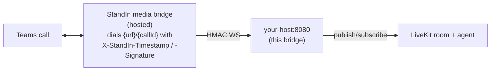

This bridge does not join Teams calls itself. That is the job of **StandIn** (the "StandIn media bridge") - a hosted service that joins your Teams meeting or answers your Teams bot, handles the Teams media, and dials into this bridge. This page explains the connection model, the tiers, and the shared secret.

## The connection model

- **The bridge is a WebSocket server.** It listens on `BIND:PORT` (default `0.0.0.0:8080`) and waits.
- **The StandIn media bridge is the client.** For each Teams call it opens **one WebSocket** to your bridge, appending the call id to the URL path (the call id is the last path segment).
- **Authentication is HMAC over a shared secret.** Both sides hold the same secret. On the WebSocket upgrade, StandIn sends two headers whose signature is `HMAC-SHA256(secret, "{timestampMs}.{callId}")`. The bridge verifies it (constant-time, inside a 60 s freshness window, with a single-use replay guard) before accepting the connection. A mismatch is rejected with `401`.



From the bridge's point of view **the connection is identical across all tiers** - same server, same HMAC WebSocket, same protocol. The tier only decides which StandIn identity and which limits apply.

:::caution
The URL you give StandIn must be reachable from the internet (a public endpoint, a reverse proxy, or a tunnel), and the shared secret rides this connection - terminate TLS (`wss://`) in front of the bridge in production.
:::

## The three tiers

Pick the tier that matches where you are:

### Sandbox - instant trial

The quickest way to try it. You generate a Teams meeting link and a **shared StandIn bot** joins it - **no Azure/Teams bot of your own required**. It is time-limited (about **5 minutes/day per session**). Start at [standin.komaa.com/sandbox](https://standin.komaa.com/sandbox).

Use it to: confirm your bridge works and hear your LiveKit agent on a real call in minutes.

### Free - developer tier

**Bring your own Microsoft Teams bot** (an Azure Bot) and **pair it in the StandIn dashboard**. Pairing issues the shared secret. The free tier is **daily-capped (5 minutes/day)** and gets its own slot.

Use it to: develop against your own bot identity and tenant.

### Subscription - production

Your own Teams bot, **no daily cap**, managed in the StandIn dashboard.

Use it to: run the agent in production for your users.

## Where the shared secret comes from

- **Sandbox:** the sandbox page issues a secret for the session - copy it into `WORKER_SHARED_SECRET`.
- **Free / Subscription:** **pairing your bot in the StandIn dashboard issues the secret.** Copy it into `WORKER_SHARED_SECRET`.

The value in your env **must equal** the value StandIn holds, or the HMAC handshake fails with `401`. For account, dashboard, and bot-pairing specifics, follow the StandIn docs at [docs.komaa.com](https://docs.komaa.com).

## Pointing an identity at this bridge

In the StandIn dashboard, set your identity's **agent WebSocket URL** to where this bridge listens, for example:

```text
wss://el-bridge.example.com:8080/voice/msteams/stream
```

StandIn appends `/{callId}` per call. Any base path works - the bridge takes the **last path segment** as the call id and verifies it against the HMAC signature and the `session.start` body.

## The cutoff goodbye

Two governors can end a call, and both speak before hanging up:

- **StandIn-side (tier limits):** when a sandbox/free daily cap or a subscription max-minutes governor is reached, StandIn sends an `assistant.say` message with a short goodbye line. The bridge forwards it to your agent on the `teams.goodbye` data topic (the agent speaks it - there is no bridge-side TTS on the room transport) and the call is torn down by StandIn. The caller hears a clean sign-off rather than a sudden drop.
- **Bridge-side (`MAX_CALL_MINUTES`):** your own hard cap per call, useful because ElevenLabs knows nothing about your budget. See [Governors and Privacy](/livekit-msteams-bridge-py/governors-and-privacy/).

If both fire at once, the first goodbye wins - the bridge never speaks two.
