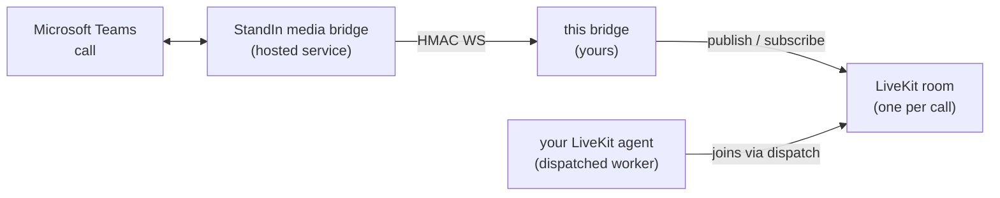

Welcome! **`livekit-msteams-bridge`** (PyPI: [`livekit-msteams-bridge`](https://pypi.org/project/livekit-msteams-bridge/)) puts a [LiveKit Agent](https://docs.livekit.io/agents/) - including [avatar agents](https://github.com/livekit/agents/tree/main/examples/avatar_agents) - on a real **Microsoft Teams call**.

It is a small asyncio service (and importable Python library) that sits between a WebSocket and a LiveKit room:

The hosted **StandIn media bridge** ([standin.komaa.com](https://standin.komaa.com)) joins the Teams call and dials into your bridge, one authenticated WebSocket per call. The bridge creates a **fresh LiveKit room per call**, dispatches your agent into it, joins as a participant, and relays audio between the Teams side and the room. The worker speaks 16 kHz mono PCM16 natively; the room side uses the SDK's resampling `AudioSource`/`AudioStream` - the bridge itself never transcodes.

:::note
This is the Python sibling of [`@komaa/livekit-msteams-bridge`](https://github.com/komaa-com/livekit-msteams-bridge) (Node.js). Same wire contract, same environment variables - the two are drop-in interchangeable behind the same `.env` file. The `-py` suffix is only in the repository name; the PyPI package is `livekit-msteams-bridge`.
:::

## What it does

- **Any LiveKit agent, unchanged** - your agent needs no Teams-specific code. It is dispatched into a normal room and hears a normal audio track; VAD, turn-taking and interruption run inside your agent session exactly as for WebRTC callers.
- **Explicit dispatch** - one room per call, your named agent dispatched into it with per-call metadata (caller name, tenant, direction, AAD id when known) in `ctx.job.metadata`.
- **Data-topic context** - `teams.context` (participant counts, DTMF, recording state) and `teams.goodbye` (the governor's goodbye line for your agent to speak).
- **Avatar-aware** - the bridge relays the agent's voice even when an avatar republishes it, binds "the agent" by participant kind (not first-audio-wins), and survives track republishes.
- **Two call governors** - StandIn-side tier cutoffs and a bridge-side `MAX_CALL_MINUTES` hard cap, both funneling into one agent-spoken goodbye.
- **Hardened transport** - replay-proof HMAC handshake, connection and payload caps, duplicate-call rejection, dead-peer detection, graceful SIGTERM drain, Prometheus `/metrics`.

Use the sidebar to navigate. Start with **Getting Started**, or [run the example](/livekit-msteams-bridge-py/example/) to see a full working setup (voice agent + bridge), then jump to **Agents and Dispatch** or the **Configuration Reference**.
